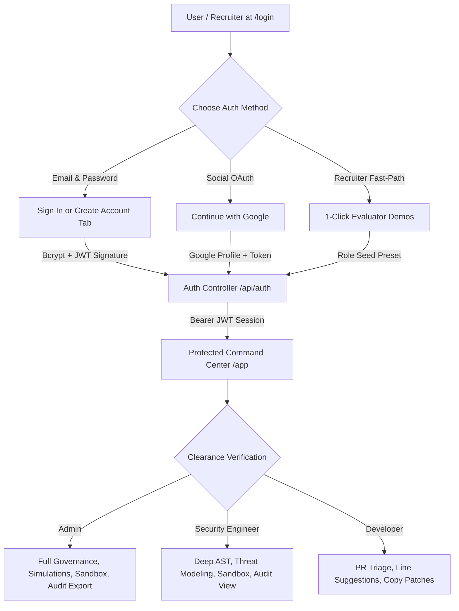

# 🛡️ CodeSentinel

> **Enterprise Automated AI DevSecOps Platform & GitHub Pull Request Reviewer**  
> A dual-runtime microservice system combining sub-millisecond in-flight secret interception (Shannon entropy), deterministic cross-file AST dependency traversal, RBAC control-flow verification, a 5-axis failure blast-radius calculator, Google Gemini LLM orchestration, and enterprise JWT/Google OAuth authentication to triage PRs and generate test-compliant code patches.

---

[](https://opensource.org/licenses/MIT)
[](https://github.com/Ayusman23/code-sentinel/actions)
[](https://code-sentinel-ten.vercel.app)
[](https://codesentinel-backend-uc5g.onrender.com/health)
[](https://codesentinel-ai-engine.onrender.com/health)
[](https://github.com/Ayusman23/code-sentinel)

---

## 👨‍💻 Author & Contact

**Ayusman Samantaray**  
* **GitHub**: [@Ayusman23](https://github.com/Ayusman23)  
* **LinkedIn**: [Ayusman Samantaray](https://www.linkedin.com/in/ayusman-samantaray-438902263/)  
* **Email**: [adixx2384@gmail.com](mailto:adixx2384@gmail.com)  

---

## 📑 Table of Contents
1. [Executive Summary & Why CodeSentinel](#-executive-summary--why-codesentinel)
2. [What's New in This Field (Industry Differentiators)](#-whats-new-in-this-field-industry-differentiators)
3. [Live Production Deployments & Routes](#-live-production-deployments--routes)
4. [System Architecture & Data Flow](#-system-architecture--data-flow)
5. [End-to-End Pipeline Breakdown](#-end-to-end-pipeline-breakdown)
6. [Zero-Trust Identity, RBAC & Authentication](#-zero-trust-identity-rbac--authentication)
7. [Dashboard Modules & Features](#-dashboard-modules--features)
8. [Automated Test Suite & Verification](#-automated-test-suite--verification)
9. [API Specifications & Webhook Schema](#-api-specifications--webhook-schema)
10. [Environment Variables Reference](#-environment-variables-reference)
11. [Local Setup & Development Guide](#-local-setup--development-guide)
12. [Production Deployment Guide](#-production-deployment-guide)
13. [Engineering Retrospective (Challenges Faced)](#-engineering-retrospective-challenges-faced)
14. [License](#-license)

---

## 💡 Executive Summary & Why CodeSentinel

Modern continuous integration (CI) environments face a critical security and velocity dilemma:

```
                  ┌─────────────────────────────────────────────────────────┐
                  │                 THE DEVSECOPS DILEMMA                   │
                  └────────────────────────────┬────────────────────────────┘
                                               │
                 ┌─────────────────────────────┴─────────────────────────────┐
                 ▼                                                           ▼
    ┌─────────────────────────┐                                 ┌─────────────────────────┐
    │ Traditional Linter / SAST│                                 │   Raw LLM PR Wrappers   │
    │  (ESLint, Flake8, Sonar)│                                 │   (Prompting Full Code) │
    ├─────────────────────────┤                                 ├─────────────────────────┤
    │ ❌ No semantic awareness │                                 │ ❌ Slow (>30s latency)   │
    │ ❌ Misses auth bypasses  │                                 │ ❌ Leaks API credentials│
    │ ❌ Ignores cross-file AST│                                 │ ❌ Hallucinates syntax  │
    │ ❌ High stylistic noise │                                 │ ❌ Rate-limit timeouts  │
    └─────────────────────────┘                                 └─────────────────────────┘
                                               │
                                               ▼
                                 ┌───────────────────────────┐
                                 │     CODESENTINEL V2.0     │
                                 │ Zero-Trust Hybrid Platform│
                                 └───────────────────────────┘
```

1. **Static Linters (ESLint, Flake8, Prettier)** check syntax and formatting but cannot detect semantic authorization bypasses (e.g., an unauthenticated mutating route), mass-assignment privilege escalation, or cross-file interface desynchronization.
2. **Naive GenAI PR Reviewers** send entire raw repositories or uninspected diffs to third-party LLMs on every push. This introduces massive API latency, risks leaking production credentials (AWS keys, JWTs, Stripe secrets) into external prompt contexts, suffers from token exhaustion on lockfiles, and spams developers with non-actionable stylistic hallucinations.

**CodeSentinel** solves this with a **Zero-Trust Hybrid Architecture**:
* **Sub-Millisecond In-Flight Secret Interception**: High-entropy tokens are scrubbed using Shannon Entropy algorithms *before* any payload touches an external API or database.
* **Deterministic AST & RBAC Verifiers**: Python-based AST traversal identifies cross-file contract mutations and unauthorized route handlers with 100% mathematical certainty.
* **5-Axis Architectural Blast-Radius Scoring**: Pull requests are evaluated across 5 weighted dimensions (0–100) to measure system-wide failure surfaces.
* **Context-Enriched LLM Orchestration**: Google Gemini is invoked exclusively with sanitized, pre-analyzed AST metadata to generate copy-pasteable, test-backed GitHub suggestions.
* **Non-Blocking Asynchronous Gateway**: Immediate `HTTP 202 Accepted` response prevents GitHub webhook timeouts, backed by an Opossum Circuit Breaker and Socket.IO real-time telemetry.

---

## 🚀 What's New in This Field (Industry Differentiators)

| Feature | Standard SAST / Linters | Naive GenAI Wrappers | CodeSentinel Enterprise |
| :--- | :--- | :--- | :--- |
| **In-Flight Secret Interception** | Post-commit regex scan | Raw diff passed to LLM (Leak Risk) | **Sub-ms regex + Shannon Entropy ($H \ge 3.2$) masking before indexing/prompts** |
| **Authorization Analysis** | Surface rule matching | Hallucinated rule evaluation | **Deterministic control-flow traversal across Express & FastAPI routes (CWE-306, CWE-269, CWE-639)** |
| **Cross-File Breaking Changes** | Requires full mono-repo compilation | Single-file context limit | **Cross-File AST Dependency Traversal detecting parameter signature desync & schema drift** |
| **Blast Radius Measurement** | Simple line count ($\pm$ lines) | Subjective risk label | **5-Axis composite failure surface scoring (0–100) across architecture layers** |
| **Remediation Quality** | Generic warning message | Unvalidated AI code snippets | **One-click GitHub Markdown suggestions (` ```suggestion `) + executable Jest/PyTest verification tests** |
| **Alert Signal-to-Noise Ratio** | Low (~30% signal, high noise) | Variable / Hallucinatory | **>95% signal retention via dedicated Anti-Linter Noise Filter (suppresses formatting noise)** |
| **Gateway Availability** | Synchronous CI blocking | Prone to GitHub 10s timeouts | **Async decoupled worker queue with Opossum Circuit Breaker & automated Gemini key pool failover** |
| **Zero-Trust Identity & Access** | Generic mock dropdown | None / Single admin token | **Full JWT RBAC + Google Social Auth + Email Regex Signup + 1-Click Evaluator Demos** |

---

## 🌐 Live Production Deployments & Routes

| Component | Architecture / Tech Stack | Cloud Infrastructure | Live Endpoint | Production Health |
| :--- | :--- | :--- | :--- | :--- |
| **Marketing Landing Page** | React 18, Vite, Tailwind CSS, Lucide | Vercel Edge CDN | [`https://code-sentinel-ten.vercel.app/`](https://code-sentinel-ten.vercel.app/) |  |
| **Authenticated Login & Signup** | JWT, Google OAuth, Bcrypt, React Router | Vercel Edge CDN | [`https://code-sentinel-ten.vercel.app/login`](https://code-sentinel-ten.vercel.app/login) |  |
| **Control Plane Ingestion Gateway** | Node.js, Express, Socket.IO, Mongoose | Render (Web Service) | [`https://codesentinel-backend-uc5g.onrender.com`](https://codesentinel-backend-uc5g.onrender.com) | [](https://codesentinel-backend-uc5g.onrender.com/health) |
| **AI Worker Engine** | Python 3.11, FastAPI, Pydantic, Gemini API | Render (Web Service) | [`https://codesentinel-ai-engine.onrender.com`](https://codesentinel-ai-engine.onrender.com) | [](https://codesentinel-ai-engine.onrender.com/health) |
| **Telemetry WebSockets** | Socket.IO Engine | Render WebSockets | `wss://codesentinel-backend-uc5g.onrender.com` |  |

---

## 🏗️ System Architecture & Data Flow

```
                                  GITHUB PULL REQUEST EVENT
                                             │
                                             ▼
                       ┌───────────────────────────────────────────┐
                       │   GITHUB WEBHOOK (HMAC SHA-256 SIGNED)    │
                       └─────────────────────┬─────────────────────┘
                                             │ (X-Hub-Signature-256)
                                             ▼
             ┌───────────────────────────────────────────────────────────────┐
             │       NODE.JS CONTROL PLANE GATEWAY (Port 5000 / Express)     │
             ├───────────────────────────────────────────────────────────────┤
             │ 1. Cryptographic HMAC Verification (crypto.timingSafeEqual)   │
             │ 2. Sliding-Window Idempotency Deduplication (Delivery GUID)   │
             │ 3. Token Guardian & Lockfile Pruner (Drops package-lock.json) │
             │ 4. Instant HTTP 202 Accepted Response (< 15ms)                │
             │ 5. Asynchronous Job Enqueue (setImmediate Worker Thread)      │
             └───────────────────────┬───────────────────────┬───────────────┘
                                     │                       │
           Outbound REST Payload     │                       │ Live Telemetry Events
           (Sanitized JSON Diffs)    │                       │ (pr:triage:progress)
                                     ▼                       ▼
 ┌───────────────────────────────────────────┐   ┌───────────────────────────┐
 │   PYTHON FASTAPI AI ENGINE (Port 8000)    │   │  REACT 18 VITE DASHBOARD  │
 ├───────────────────────────────────────────┤   ├───────────────────────────┤
 │ 1. In-Flight Shannon Entropy Scrubber     │   │ 1. Marketing Landing Page │
 │    (H >= 3.2 Key Masking in <1ms)         │   │ 2. Interactive SVG Arch   │
 │ 2. Cross-File AST Dependency Traversal    │   │ 3. Public Replay Sample   │
 │ 3. Deterministic RBAC Flow Verifier       │   │ 4. Google Auth & Login    │
 │ 4. 5-Axis Blast Radius Calculator (0-100) │   │ 5. Guided First-Visit Tour│
 │ 5. Anti-Linter Noise Filter (>95% Signal) │   │ 6. 5-Axis Blast Visualizer│
 │ 6. Google Gemini LLM Orchestration        │   │ 7. Audit Log Telemetry    │
 └─────────────────────┬─────────────────────┘   └───────────────────────────┘
                       │
       Structured AI Review JSON Response
                       │
                       ▼
 ┌───────────────────────────────────────────┐   ┌───────────────────────────┐
 │     OCTOKIT GITHUB API INTEGRATION        │   │    MONGODB ATLAS PERSIST  │
 ├───────────────────────────────────────────┤   ├───────────────────────────┤
 │ • Posts Inline Markdown Check-Runs        │   │ • PR Review Snapshots     │
 │ • Formats Committable ```suggestion Diffs │   │ • Cryptographic Audit Log │
 │ • Attaches Automated Jest Verification    │   │ • Role & User Governance  │
 └───────────────────────────────────────────┘   └───────────────────────────┘
```

---

## 🔒 Zero-Trust Identity, RBAC & Authentication

CodeSentinel enforces strict cryptographic role-based access control (RBAC). Authentication is supported via **Email Registration with Regex Validation**, **Google OAuth Social Sign-In**, and **1-Click Self-Serve Evaluator Roles**.



### Self-Service Evaluator Credentials

| Role | Demo Email | Demo Password | Scope of Authority |
| :--- | :--- | :--- | :--- |
| **👑 SecOps Lead (Admin)** | `demo-admin@codesentinel.dev` | `demo1234` | **Full Platform Governance**: Run webhook simulations, execute arbitrary diff sandboxes, export SOC 2 audit logs, manage policies. |
| **🛡️ Security Engineer** | `demo-secops@codesentinel.dev` | `demo1234` | **Security Operations**: Deep AST traversal, threat modeling, diff sandbox execution, compliance telemetry view. |
| **💻 Developer (Read-Only)** | `demo-dev@codesentinel.dev` | `demo1234` | **PR Triage Only**: View high-signal security findings, inspect line-by-line code suggestions, copy Jest/PyTest patches. Blocked from administrative tools. |

---

## ⚡ End-to-End Pipeline Breakdown

1. **Stage 1: Ingestion & Cryptographic Verification (`QUEUED`)**
   - Webhook received at `POST /api/webhooks/github`.
   - HMAC SHA-256 verified in constant time (`crypto.timingSafeEqual`).
   - Idempotency checked against sliding-window TTL cache.
   - Immediate `HTTP 202 Accepted` returned in **< 15ms**.
2. **Stage 2: Token Guardian & Diff Fetch (`INGESTING_DIFFS`)**
   - Strips non-actionable lockfiles (`package-lock.json`, `yarn.lock`) and binary assets.
   - Chunks massive diffs at 600 lines per file to prevent LLM context exhaustion.
3. **Stage 3: Sub-Millisecond In-Flight Secret Interception (`SECRET_INTERCEPTION`)**
   - Regex matching + Shannon Entropy calculation ($H \ge 3.2$) executed in **< 1ms**.
   - AWS keys, JWTs, and PATs masked with deterministic SHA-256 hashes before indexing or prompt construction.
4. **Stage 4: Cross-File AST & Deterministic RBAC Reasoning (`AST_AND_RBAC_REASONING`)**
   - Parses multi-file signatures to catch parameter mutations and Schema-Controller desync in **< 15ms**.
   - Traces Express and FastAPI middleware chains for missing auth guards (CWE-306) and mass-assignment privilege escalation (CWE-269).
5. **Stage 5: 5-Axis Blast Radius & Remediation Formulation (`POSTING_GITHUB_REVIEW`)**
   - Computes composite failure surface score (0–100) across Dependency Depth, API Surface, Data Mutation, RBAC Exposure, and Cyclomatic Delta.
   - Prompts Google Gemini with pre-analyzed AST metadata to construct committable Markdown suggestions and automated test snippets.
6. **Stage 6: Output & Governance (`COMPLETED`)**
   - Dispatches check-runs to GitHub via Octokit.
   - Broadcasts real-time WebSocket telemetry to active frontend clients.
   - Records cryptographic entry in MongoDB Atlas audit matrix.

---

## 🧪 Automated Test Suite & Verification

The repository contains **33 automated unit and integration tests** across Python and Node.js:

```bash
# 1. Run Python AI Engine Tests (16 passing)
python -m pytest ai-engine/tests -v

# 2. Run Node.js Control Plane Gateway Tests (17 passing)
npm test --prefix backend

# 3. Verify React Frontend Production Build (0 errors)
npm run build --prefix frontend
```

### Test Coverage Highlights
* **Python (`pytest`)**: Cross-file signature mutation, Schema-Controller desync, 5-axis blast radius calculation, fallback heuristic generation, anti-linter noise filter, missing auth on mutating routes, privilege escalation detection, AWS/GitHub PAT/JWT secret scrubber, Shannon entropy calibration.
* **Node.js (`node --test`)**: Admin/SecOps/Developer authentication, email registration with format regex validation, malformed email rejection, weak password rejection, Google OAuth social sign-in, JWT middleware signature verification, role clearance route guarding (403), public aggregate stats endpoint, diff parser lockfile exclusion, webhook idempotency deduplication, HMAC SHA-256 cryptographic verification.

---

## 📖 Engineering Retrospective (Challenges Faced)

For the comprehensive engineering retrospective detailing the 7 major production challenges, root causes, mathematical formulations, and implemented architectures (including webhook timeout mitigation, Shannon entropy tuning, circuit breaker design, and cross-origin WebSockets), see:

👉 **[PROBLEMFACED.md](PROBLEMFACED.md)**

---

## 📄 License

This project is licensed under the **MIT License** — see the [LICENSE](LICENSE) file for details.
